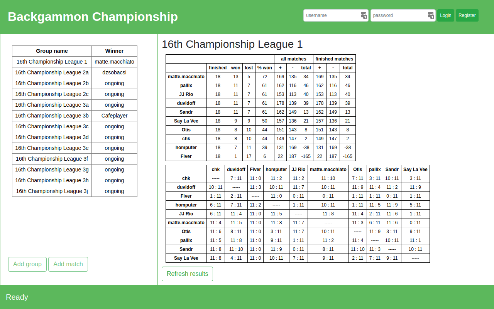

# bg-admin-tool
A web app that allows easy follow-up of the Backgammon Championship results.

[Click here](https://bg-admin-tool.herokuapp.com/) to start

## as a guest user
You can view and refresh the results of a selected group. Select a group by
clicking to its name on the left side. By pressing the "refresh results" button,
the app automatically fetches the match results from DailyGammon.
The cells of the bottom table are clickable and the links bring you to the
corresponding match review page on DailyGammon.

## as a registered administrator

### you can add a new group
Fill the form with the group name and the usernames of the players. Make sure
that the usernames are written exactly as they are on DailyGammon.
Once submitted, the app tries to find all matches and their results on
Dailygammon. This operation comes with quite some requests to DailyGammon, so
be patient. After confirmation, the results are saved to the underlying database
and they become visible on the right side.

### you can add a new match
In some cases not all matches can be found automatically. This happens most
frequently because the match's "Event" on DailyGammon is not the same as the
group's name. In such cases, you have to find the missing matches manually on
DailyGammon, and enter the match-ID and the group name to the form.
After confirmation, the match result is saved to the underlying database and it
becomes visible on the right side.
